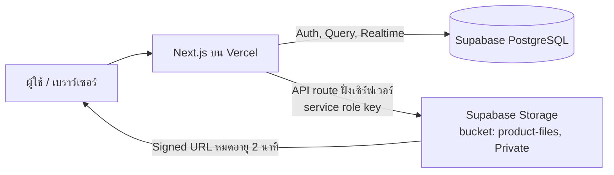
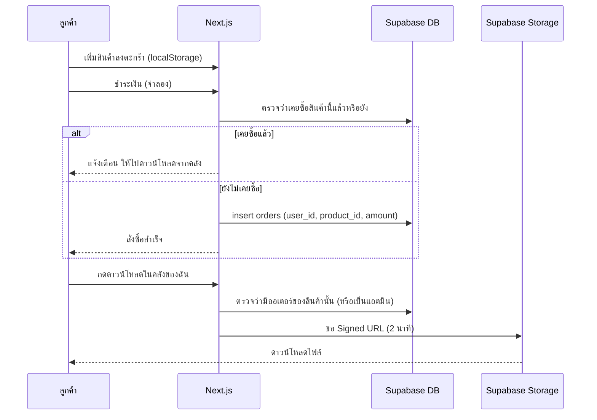
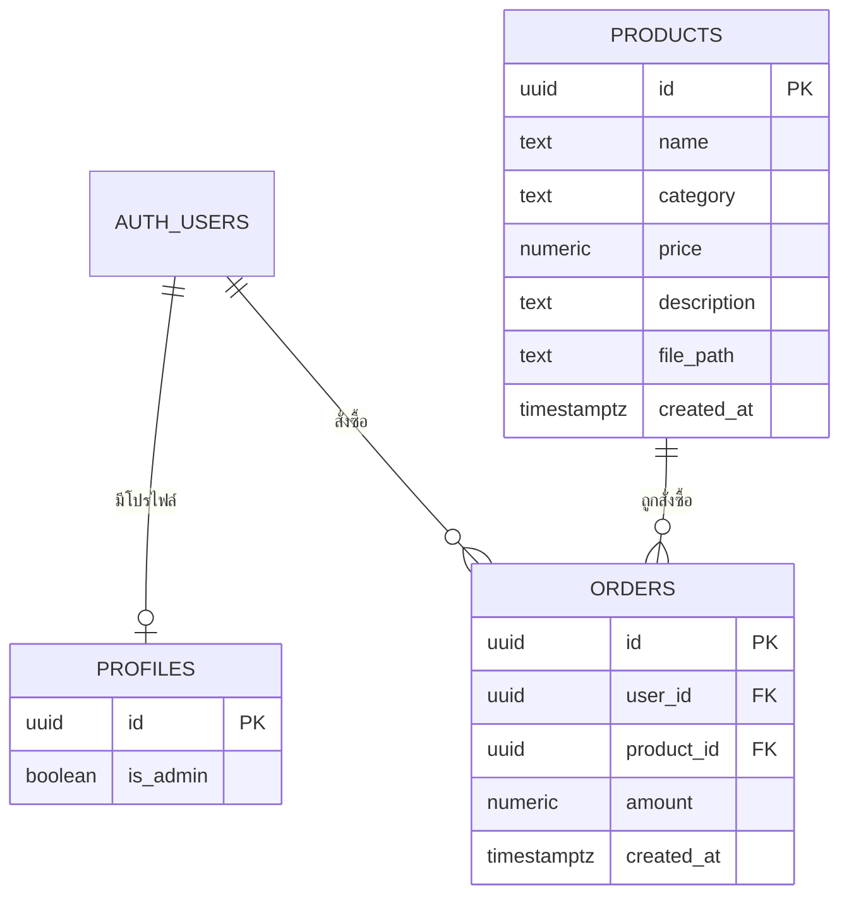
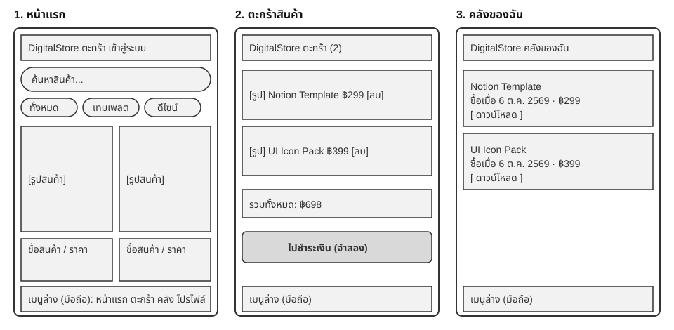
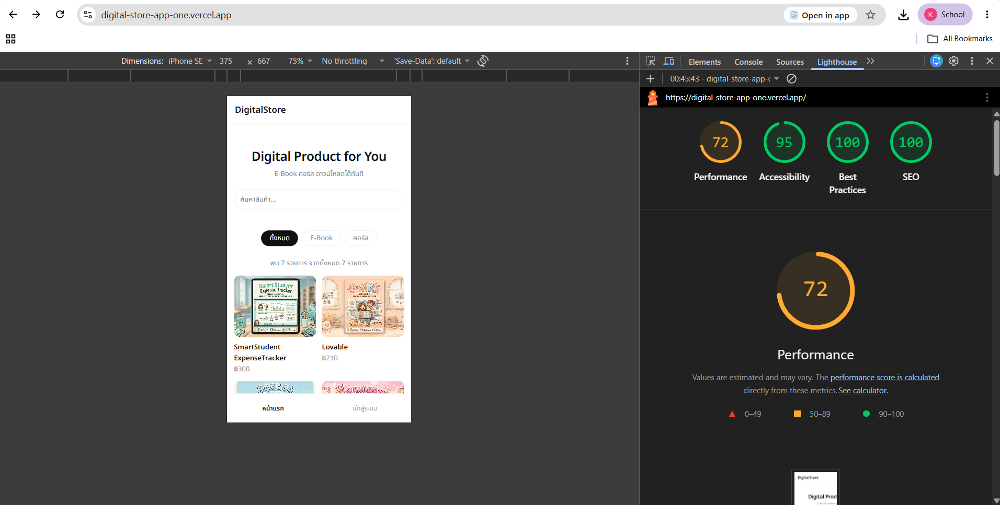

# PROJECT.md — DigitalStore

**ผู้จัดทำ:** นางสาวกาญต์สินี แดงแท้ รหัสนักศึกษา 67332310072-6 กลุ่ม ECP4R (งานเดี่ยว)

**Repository:** https://github.com/Kansinee-da/digital-store-app

**เว็บที่ deploy แล้ว:** https://digital-store-app-one.vercel.app

## 1. ภาพรวมโปรเจกต์

DigitalStore คือร้านขายสินค้าดิจิทัล (E-Book, เทมเพลต) ครบวงจร ลูกค้าเลือกซื้อ ชำระเงิน และดาวน์โหลดไฟล์ได้ทันที ส่วนแอดมินมีระบบหลังบ้านสำหรับจัดการสินค้า ออเดอร์ และลูกค้า

> การชำระเงินเป็น**โหมดจำลอง** (ยังไม่ต่อ Stripe จริง) เพื่อให้สาธิตได้ง่าย แต่ออเดอร์ถูกบันทึกลงตาราง `orders` จริง

## 2. Spec: ฟีเจอร์และพฤติกรรมของระบบ

### ฝั่งลูกค้า
| ฟีเจอร์ | พฤติกรรมที่คาดหวัง |
|---|---|
| สมัครสมาชิก / เข้าสู่ระบบ / แก้ไขโปรไฟล์ | ใช้ Supabase Auth |
| ดูสินค้า ค้นหา กรองหมวดหมู่ | ทุกคนดูรายการสินค้าได้ (RLS: select ทั้งหมด) |
| ตะกร้าสินค้า | เก็บใน localStorage |
| ชำระเงิน (จำลอง) | กด "ฉันสแกนจ่ายแล้ว" ระบบถือว่าจ่ายสำเร็จและสร้างออเดอร์ |
| ประวัติคำสั่งซื้อ / คลังของฉัน | แสดงเฉพาะออเดอร์ของผู้ใช้ที่ล็อกอิน พร้อมวันที่และราคา |
| ดาวน์โหลดไฟล์ | เฉพาะผู้ที่มีออเดอร์ของสินค้านั้น (หรือแอดมิน)  |
| กันซื้อซ้ำ | ถ้าเคยซื้อแล้วจะแจ้งเตือนและพาไปดาวน์โหลดจากคลัง ตรวจทั้งหน้าสินค้าและฝั่งเซิร์ฟเวอร์ตอนชำระเงิน |

### ฝั่งแอดมิน
- Dashboard: ยอดขาย สินค้า ลูกค้า สถิติ
- เพิ่ม / เลิกขายสินค้า
- จัดการออเดอร์และลูกค้า
- Import / Export สินค้า (CSV, JSON)
- เพิ่ม / ถอนสิทธิ์แอดมิน (เฉพาะเจ้าของระบบ)

### Realtime (Supabase Realtime)
- เพิ่มหรือถอนสิทธิ์แอดมินแล้วเมนูเปลี่ยนทันที ผู้ที่ถูกถอนสิทธิ์จะถูกพาออกจากหน้า `/admin`
- หน้าร้านอัปเดตทันทีเมื่อแอดมินเพิ่มหรือเลิกขายสินค้า

### เทคโนโลยี
Next.js (App Router), React, TypeScript / Supabase (Auth, PostgreSQL, Storage, Realtime) / Vitest / GitHub Actions / Vercel

## 3. การออกแบบและ Diagram

### 3.1 สถาปัตยกรรมระบบ

### 3.2 Flow การซื้อและดาวน์โหลด

### 3.3 ERD

> ตาราง `profiles` มีคอลัมน์ `is_admin` ใช้ตรวจสิทธิ์แอดมินผ่านฟังก์ชัน `is_admin` (คอลัมน์อื่นของ `profiles` ดูใน `supabase/schema.sql`)

### 3.4 ฐานข้อมูลและความปลอดภัย

- สคริปต์สร้างตาราง: `supabase/schema.sql`
- เปิด Row Level Security ทั้งตาราง `products` และ `orders`
  - `products`: ทุกคนอ่านได้ (policy "ทุกคนดูสินค้าได้")
  - `orders`: อ่านได้เฉพาะแถวของตัวเอง `auth.uid() = user_id` (policy "ดูได้เฉพาะออเดอร์ตัวเอง")
- ไฟล์สินค้าอยู่ใน bucket แบบ Private ดาวน์โหลดผ่านลิงก์ที่หมดอายุใน 2 นาที
- `SUPABASE_SERVICE_ROLE_KEY` ใช้ฝั่งเซิร์ฟเวอร์เท่านั้น ไม่อัปขึ้น GitHub (`.env.local` อยู่ใน `.gitignore`)

## 4. การทดสอบ (Test) และ CI

### 4.1 Test case (ทดสอบด้วยตนเองบนเว็บที่ deploy แล้ว)

| # | กรณีทดสอบ | ผลที่คาดหวัง | ผล |
|---|---|---|---|
| 1 | สมัครสมาชิกและเข้าสู่ระบบ | เข้าสู่ระบบสำเร็จ เห็นเมนูของผู้ใช้ | ✅ ผ่าน |
| 2 | ค้นหาและกรองสินค้าตามหมวดหมู่ | แสดงเฉพาะสินค้าที่ตรงเงื่อนไข | ✅ ผ่าน |
| 3 | เพิ่มสินค้าลงตะกร้าแล้วรีเฟรชหน้า | สินค้ายังอยู่ในตะกร้า | ✅ ผ่าน |
| 4 | ชำระเงินสินค้าที่ยังไม่เคยซื้อ | สร้างออเดอร์ และสินค้าขึ้นในคลังของฉัน | ✅ ผ่าน |
| 5 | ซื้อสินค้าซ้ำ | แจ้งเตือนและไม่สร้างออเดอร์ใหม่ | ✅ ผ่าน |
| 6 | ดาวน์โหลดไฟล์สินค้าที่ซื้อแล้ว | ได้ไฟล์ถูกต้อง | ✅ ผ่าน |
| 7 | ผู้ใช้ที่ไม่เคยซื้อพยายามดาวน์โหลด | ถูกปฏิเสธ | ✅ ผ่าน |
| 8 | ผู้ใช้ทั่วไปเข้า `/admin` | ถูกพาออกจากหน้า | ✅ ผ่าน |
| 9 | แอดมินเพิ่ม / เลิกขายสินค้า | หน้าร้านอัปเดตทันที | ✅ ผ่าน |
| 10 | Export / Import สินค้า (CSV, JSON) | ข้อมูลตรงกับที่แสดงในระบบ | ✅ ผ่าน |
| 11 | ผู้ใช้ A ดูออเดอร์ของผู้ใช้ B | ไม่เห็น (RLS) | ✅ ผ่าน |

### 4.2 Unit test อัตโนมัติ (Vitest)

ไฟล์ `__tests__/cart.test.tsx` ทดสอบ hook `useCart` จำนวน 3 กรณี และรันได้ด้วย `npm test`

| # | กรณีทดสอบ | ผล |
|---|---|---|
| 1 | เพิ่มสินค้าลงตะกร้าได้ถูกต้อง | ✅ ผ่าน |
| 2 | เพิ่มจำนวนเมื่อเพิ่มสินค้าชิ้นเดิม | ✅ ผ่าน |
| 3 | ลบสินค้าและล้างตะกร้าได้ถูกต้อง | ✅ ผ่าน |

### 4.3 CI

ใช้ GitHub Actions (`.github/workflows/ci.yml`) รันทุกครั้งที่ push และ pull request ไปที่ `main` ด้วย Node.js 20 โดยทำขั้นตอนตามลำดับ

1. `npm install` ติดตั้ง dependency
2. `npm test` รัน unit test (Vitest)
3. `npm run build` build โปรเจกต์ (รวมการตรวจชนิดข้อมูล TypeScript ของ Next.js)

ขั้นตอน build ใช้ค่า environment จำลองใน workflow เพราะบน CI ไม่มีไฟล์ `.env.local` (ไม่เก็บกุญแจจริงไว้ใน repository) นอกจากนี้ Vercel build และ deploy ทุก commit ที่ push

## 5. งานฝั่งผู้ใช้ (User-facing work)

### Persona 1: ลูกค้า ชื่อนนท์ (นักศึกษาปี 3 อายุ 21 ปี)

| หัวข้อ | รายละเอียด |
|---|---|
| พฤติกรรม | ใช้มือถือเป็นหลัก ซื้อของออนไลน์เป็นประจำ ใช้ Notion จัดการงานและชีทเรียน |
| เป้าหมาย | หาเทมเพลตคุณภาพดีในราคาไม่แพง ซื้อแล้วได้ไฟล์ทันที |
| ปัญหาที่เจอ | ซื้อซ้ำโดยไม่รู้ตัว หาไฟล์ที่เคยซื้อไม่เจอ ลิงก์ดาวน์โหลดหายหรือเข้าไม่ได้ |
| สิ่งที่ระบบช่วย | กันซื้อซ้ำ มีหน้าคลังของฉัน ดาวน์โหลดได้ทุกเมื่อ ใช้งานบนมือถือได้สะดวก (เมนูล่าง) |

### Persona 2: เจ้าของร้าน (แอดมิน) ชื่ออาย (ฟรีแลนซ์ดีไซเนอร์ อายุ 23 ปี)

| หัวข้อ | รายละเอียด |
|---|---|
| พฤติกรรม | ทำสินค้าดิจิทัลขายเอง อัปเดตสินค้าบ่อย |
| เป้าหมาย | เพิ่ม/เลิกขายสินค้าได้เร็ว ดูยอดขายและออเดอร์ได้ในที่เดียว |
| ปัญหาที่เจอ | ต้องกรอกสินค้าทีละชิ้น ไม่แน่ใจว่าใครเข้าถึงหลังบ้านได้ |
| สิ่งที่ระบบช่วย | Import/Export CSV, JSON, Dashboard ยอดขาย, จัดการสิทธิ์แอดมิน, หน้าร้านอัปเดตทันที |

> Persona เป็นตัวละครสมมติที่สร้างขึ้นจากกลุ่มผู้ใช้เป้าหมายของระบบ

### Wireframe

หน้าหลัก 3 หน้า (หน้าแรก, ตะกร้า, คลังของฉัน) ออกแบบให้ใช้งานบนมือถือเป็นหลัก มีเมนูล่าง

### ผลตรวจ Accessibility

ตรวจด้วย Lighthouse (Chrome DevTools, โหมด Mobile) บนเว็บที่ deploy แล้ว เมื่อวันที่ 6 ตุลาคม 2569 (ก่อนแก้ตรวจเวลา 02:14 ถึง 02:22 น. หลังแก้ตรวจเวลา 02:35 ถึง 02:36 น.)

| หน้า | Accessibility ก่อนแก้ | Accessibility หลังแก้ |
|---|---|---|
| หน้าแรก | 95 / 100 | **100 / 100** |
| รายละเอียดสินค้า | 95 / 100 | **100 / 100** |
| ตะกร้า | 95 / 100 | **100 / 100** |

- **ปัญหาที่พบ:** ข้อ Contrast ข้อเดียวทั้ง 3 หน้า คือตัวอักษรสีเทาอ่อนบนพื้นขาวมีอัตราส่วนความต่างสีไม่ถึงเกณฑ์ 4.5:1 ได้แก่ ลิงก์ในเมนูล่างบนมือถือ (`nav.nav-bottom`) และข้อความรองที่ใช้ตัวแปรสี `--mute`
- **สาเหตุ:** เมนูใช้สีเทา `#999` (ประมาณ 2.8:1) และตัวแปร `--mute` เป็น `#8a8a8a` (ประมาณ 3.5:1)
- **สิ่งที่แก้ไข:** เปลี่ยนสีทั้งสองเป็น `#6b6b6b` (ประมาณ 5.3:1) ในไฟล์ `app/globals.css` (ตัวแปร `--mute`) และ `components/Nav.tsx` (สีลิงก์เมนู 2 จุด) แล้ว deploy ตรวจซ้ำได้ 100 ทั้ง 3 หน้า
- **หมายเหตุ:** หน้าแรกหลังแก้ตรวจตอนยังไม่ล็อกอิน ส่วนหน้ารายละเอียดสินค้าและตะกร้าตรวจตอนล็อกอิน

**ภาพผลตรวจ:**

## 6. ผลการรัน CI

ดูผลการรันทุกครั้งได้ที่ https://github.com/Kansinee-da/digital-store-app/actions

## 7. บันทึกการใช้ AI

<!-- ตรวจสอบช่อง "เครื่องมือ" และกรอก "ตัวอย่างคำสั่งที่ใช้" ให้ตรงกับที่ใช้จริงก่อนส่ง -->

| หัวข้อ | รายละเอียด |
|---|---|
| เครื่องมือ | claude.ai (ออกแบบโครงสร้างฐานข้อมูล เขียนโค้ดหลัก และช่วยแก้ปัญหา CI, Next.js 15, Accessibility) และ Gemini (ช่วยแก้ไฟล์บางส่วนและร่างเอกสารช่วงท้ายโปรเจกต์) |
| ส่วนที่ผู้จัดทำออกแบบเอง | ฟีเจอร์ทั้งหมด โครงสร้างหน้าเว็บ โครงสร้างฐานข้อมูล (ตาราง products, orders, profiles) และกฎสิทธิ์ (RLS, สิทธิ์แอดมิน, ดาวน์โหลดเฉพาะผู้ซื้อ) |
| ส่วนที่ AI ทำ | เขียนโค้ด Next.js / TypeScript และ SQL ตามที่ออกแบบ ช่วยหาสาเหตุเมื่อ build หรือ CI ล้ม ช่วยร่างเอกสาร |
| ตัวอย่างคำสั่งที่ใช้ |ตรวจสอบว่ามีปัญหาตรงไหนและขอแนวทางวิธีการแก้ไข|
| ปัญหาที่ AI ทำผิดหรือไม่ตรงที่ต้องการ และวิธีแก้ | 1) การแก้ไฟล์ `route.ts` หลายรอบทำให้มีวงเล็บ `{` เกินและชื่อพารามิเตอร์ไม่ตรงกัน CI ล้มต่อเนื่อง แก้โดยรัน `npm run build` และ `npm test` ในเครื่องก่อน push ทุกครั้ง 2) โค้ดเขียนแบบ Next.js 14 ทำให้ build ล้มบน Next.js 15 เพราะ `params` และ `searchParams` ต้องเป็น Promise แก้ใน 3 ไฟล์ 3) CI ล้มเพราะไม่มีไฟล์ `.env.local` บนเซิร์ฟเวอร์ แก้โดยใส่ค่าจำลองใน `ci.yml` 4) Vercel ไม่ยอม deploy เพราะ Next.js 15.1.7 มีช่องโหว่ แก้โดยอัปเกรดเป็น 15.5 5) AI แนะนำให้แก้สีตัวแปร `--mute` อย่างเดียว แต่ Lighthouse ยังพบปัญหา Contrast ในเมนู จึงต้องแก้สีใน `Nav.tsx` เพิ่ม |
| การตรวจสอบผล | ทดสอบตามตาราง test case ทั้ง 11 ข้อบนเว็บที่ deploy ตรวจ RLS และการดาวน์โหลด รัน unit test และ CI ทุกครั้งที่ push ตรวจ Accessibility ด้วย Lighthouse ก่อนและหลังแก้ |

## 8. ข้อจำกัดและแผนต่อยอด

- การชำระเงินยังเป็นโหมดจำลอง ต่อ Stripe จริงได้โดยแก้ที่ `app/api/checkout/route.ts` และสร้างออเดอร์หลังยืนยันว่าจ่ายสำเร็จ
- ราคาในการชำระเงินควรคำนวณจากตาราง `products` ฝั่งเซิร์ฟเวอร์ (ปัจจุบันรับจากหน้าเว็บ)
- ทำเป็นแอปมือถือด้วย Capacitor / PWABuilder และแอปเดสก์ท็อปด้วย Tauri / Electron ได้ โดยใช้ backend Supabase ชุดเดิม

## 9. วิธีรันในเครื่อง

ดูขั้นตอนเต็มและตัวแปร environment ใน [README.md](README.md) โดยสรุปคือ `npm install` → ตั้งค่า `.env.local` → รัน `supabase/schema.sql` → `npm run dev` (ทดสอบด้วย `npm test`)
