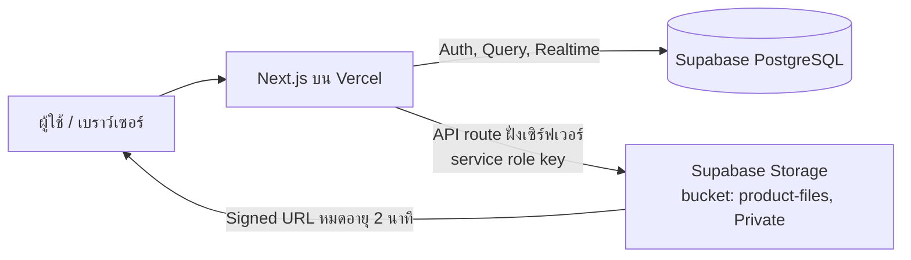
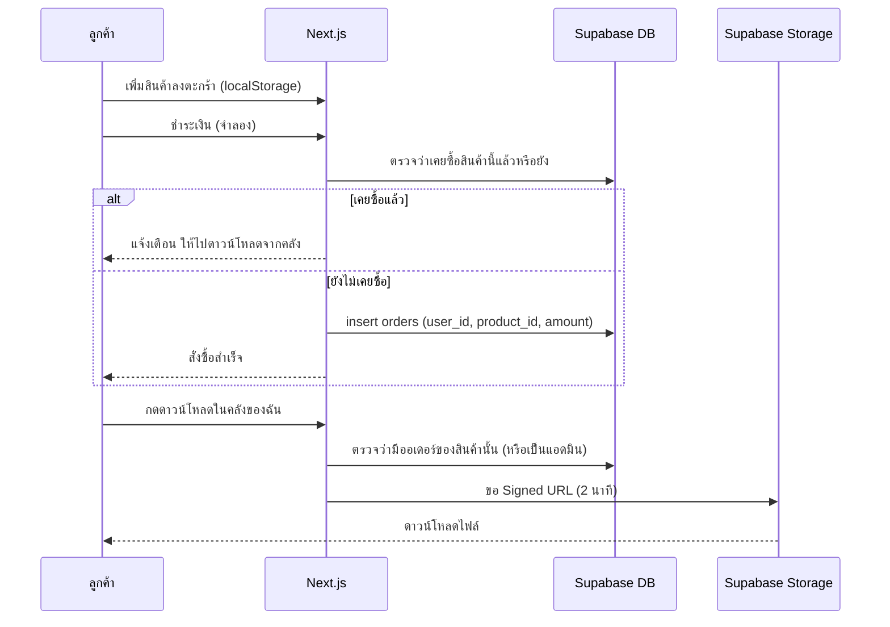
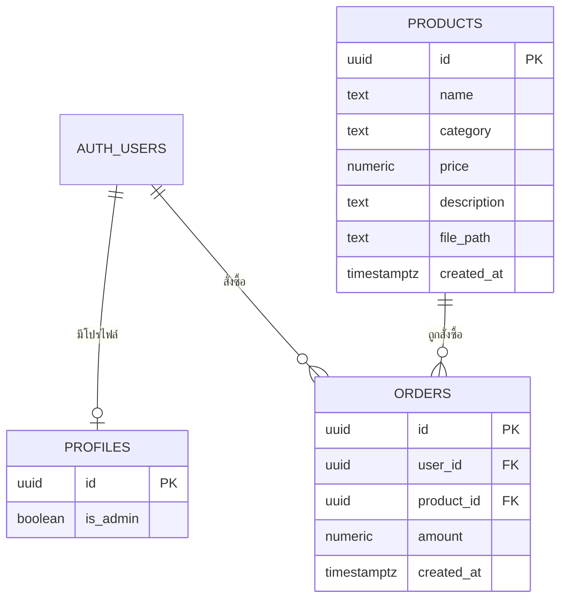

# PROJECT.md — DigitalStore

**ผู้จัดทำ:** นางสาวกาญต์สินี แดงแท้ รหัสนักศึกษา 67332310072-6 กลุ่ม ECP4R (งานเดี่ยว)
**Repository:** https://github.com/Kansinee-da/digital-store-app

**เว็บที่ deploy แล้ว:** https://digital-store-app-one.vercel.app

## 1. ภาพรวมโปรเจกต์

DigitalStore คือร้านขายสินค้าดิจิทัล (E-Book, เทมเพลต, ชุดไอคอน ฯลฯ) ครบวงจร ลูกค้าเลือกซื้อ ชำระเงิน และดาวน์โหลดไฟล์ได้ทันที ส่วนแอดมินมีระบบหลังบ้านสำหรับจัดการสินค้า ออเดอร์ และลูกค้า

> การชำระเงินเป็น**โหมดจำลอง** (ยังไม่ต่อ Stripe จริง) เพื่อให้สาธิตได้ง่าย แต่ออเดอร์ถูกบันทึกลงตาราง `orders` จริง

## 2. Spec: ฟีเจอร์และพฤติกรรมของระบบ

### ฝั่งลูกค้า
| ฟีเจอร์ | พฤติกรรมที่คาดหวัง |
|---|---|
| สมัครสมาชิก / เข้าสู่ระบบ / แก้ไขโปรไฟล์ | ใช้ Supabase Auth |
| ดูสินค้า ค้นหา กรองหมวดหมู่ | ทุกคนดูรายการสินค้าได้ (RLS: select ทั้งหมด) |
| ตะกร้าสินค้า | เก็บใน localStorage |
| ชำระเงิน (จำลอง) | กด "ฉันสแกนจ่ายแล้ว" ระบบถือว่าจ่ายสำเร็จและสร้างออเดอร์ |
| ประวัติคำสั่งซื้อ / คลังของฉัน | แสดงเฉพาะออเดอร์ของผู้ใช้ที่ล็อกอิน พร้อมวันที่และราคา |
| ดาวน์โหลดไฟล์ | เฉพาะผู้ที่มีออเดอร์ของสินค้านั้น (หรือแอดมิน) ลิงก์หมดอายุใน 2 นาที |
| กันซื้อซ้ำ | ถ้าเคยซื้อแล้วจะแจ้งเตือนและพาไปดาวน์โหลดจากคลัง ตรวจทั้งหน้าสินค้าและฝั่งเซิร์ฟเวอร์ตอนชำระเงิน |

### ฝั่งแอดมิน
- Dashboard: ยอดขาย สินค้า ลูกค้า สถิติ
- เพิ่ม / เลิกขายสินค้า
- จัดการออเดอร์และลูกค้า
- Import / Export สินค้า (CSV, JSON)
- เพิ่ม / ถอนสิทธิ์แอดมิน (เฉพาะเจ้าของระบบ)

### Realtime (Supabase Realtime)
- เพิ่มหรือถอนสิทธิ์แอดมินแล้วเมนูเปลี่ยนทันที ผู้ที่ถูกถอนสิทธิ์จะถูกพาออกจากหน้า `/admin`
- หน้าร้านอัปเดตทันทีเมื่อแอดมินเพิ่มหรือเลิกขายสินค้า

### เทคโนโลยี
Next.js (App Router), React, TypeScript / Supabase (Auth, PostgreSQL, Storage, Realtime) / Vercel

## 3. การออกแบบและ Diagram

### 3.1 สถาปัตยกรรมระบบ

### 3.2 Flow การซื้อและดาวน์โหลด

### 3.3 ERD

> ตาราง `profiles` มีคอลัมน์ `is_admin` ใช้ตรวจสิทธิ์แอดมินผ่านฟังก์ชัน `is_admin` (คอลัมน์อื่นของ `profiles` ดูใน `supabase/schema.sql`)

### 3.4 ฐานข้อมูลและความปลอดภัย

- สคริปต์สร้างตาราง: `supabase/schema.sql`
- เปิด Row Level Security ทั้งตาราง `products` และ `orders`
  - `products`: ทุกคนอ่านได้ (policy "ทุกคนดูสินค้าได้")
  - `orders`: อ่านได้เฉพาะแถวของตัวเอง `auth.uid() = user_id` (policy "ดูได้เฉพาะออเดอร์ตัวเอง")
- ไฟล์สินค้าอยู่ใน bucket แบบ Private ดาวน์โหลดผ่านลิงก์ที่หมดอายุใน 2 นาที
- `SUPABASE_SERVICE_ROLE_KEY` ใช้ฝั่งเซิร์ฟเวอร์เท่านั้น ไม่อัปขึ้น GitHub (`.env.local` อยู่ใน `.gitignore`)

## 4. การทดสอบ (Test) และ CI

### 4.1 Test case (ทดสอบด้วยตนเองบนเว็บที่ deploy แล้ว)

| # | กรณีทดสอบ | ผลที่คาดหวัง | ผล |
|---|---|---|---|
| 1 | สมัครสมาชิกและเข้าสู่ระบบ | เข้าสู่ระบบสำเร็จ เห็นเมนูของผู้ใช้ | ✅ ผ่าน |
| 2 | ค้นหาและกรองสินค้าตามหมวดหมู่ | แสดงเฉพาะสินค้าที่ตรงเงื่อนไข | ✅ ผ่าน |
| 3 | เพิ่มสินค้าลงตะกร้าแล้วรีเฟรชหน้า | สินค้ายังอยู่ในตะกร้า | ✅ ผ่าน |
| 4 | ชำระเงินสินค้าที่ยังไม่เคยซื้อ | สร้างออเดอร์ และสินค้าขึ้นในคลังของฉัน | ✅ ผ่าน |
| 5 | ซื้อสินค้าซ้ำ | แจ้งเตือนและไม่สร้างออเดอร์ใหม่ | ✅ ผ่าน |
| 6 | ดาวน์โหลดไฟล์สินค้าที่ซื้อแล้ว | ได้ไฟล์ถูกต้อง | ✅ ผ่าน |
| 7 | ผู้ใช้ที่ไม่เคยซื้อพยายามดาวน์โหลด | ถูกปฏิเสธ | ✅ ผ่าน |
| 8 | ผู้ใช้ทั่วไปเข้า `/admin` | ถูกพาออกจากหน้า | ✅ ผ่าน |
| 9 | แอดมินเพิ่ม / เลิกขายสินค้า | หน้าร้านอัปเดตทันที | ✅ ผ่าน |
| 10 | Export / Import สินค้า (CSV, JSON) | ข้อมูลตรงกับที่แสดงในระบบ | ✅ ผ่าน |
| 11 | ผู้ใช้ A ดูออเดอร์ของผู้ใช้ B | ไม่เห็น (RLS) | ✅ ผ่าน |

### 4.2 CI

ใช้ GitHub Actions (`.github/workflows/ci.yml`) รันทุกครั้งที่ push และ pull request ไปที่ `main` โดยทำขั้นตอน ติดตั้ง dependency, ตรวจชนิดข้อมูลด้วย TypeScript (`tsc --noEmit`) และ build โปรเจกต์ (`npm run build`) นอกจากนี้ Vercel build ทุก commit ที่ push

## 5. บันทึกการใช้ AI

- **เครื่องมือ:** ใช้ AI เพียงตัวเดียวตลอดโปรเจกต์ (ระบุชื่อ: claude.ai)
- **บทบาทของผู้จัดทำ:** เป็นผู้ออกแบบระบบเอง ทั้งฟีเจอร์ โครงสร้างหน้าเว็บ และโครงสร้างฐานข้อมูล แล้วสั่งให้ AI เขียนโค้ดตามที่ออกแบบ
- **บทบาทของ AI:** เขียนโค้ด Next.js / TypeScript และสคริปต์ SQL ตามที่สั่ง
- **การตรวจสอบผล:** ทดสอบการใช้งานบนเว็บที่ deploy แล้ว (ตามหัวข้อ 4) ตรวจสิทธิ์การเข้าถึงข้อมูลและการดาวน์โหลด และแก้ไขเมื่อผลไม่ตรงกับที่ออกแบบ

## 6. ข้อจำกัดและแผนต่อยอด

- การชำระเงินยังเป็นโหมดจำลอง ต่อ Stripe จริงได้โดยแก้ที่ `app/api/checkout/route.ts` และสร้างออเดอร์หลังยืนยันว่าจ่ายสำเร็จ
- ราคาในการชำระเงินควรคำนวณจากตาราง `products` ฝั่งเซิร์ฟเวอร์ (ปัจจุบันรับจากหน้าเว็บ)
- ทำเป็นแอปมือถือด้วย Capacitor / PWABuilder และแอปเดสก์ท็อปด้วย Tauri / Electron ได้ โดยใช้ backend Supabase ชุดเดิม

## 7. วิธีรันในเครื่อง

ดูขั้นตอนเต็มและตัวแปร environment ใน [README.md](README.md) โดยสรุปคือ `npm install` → ตั้งค่า `.env.local` → รัน `supabase/schema.sql` → `npm run dev`
